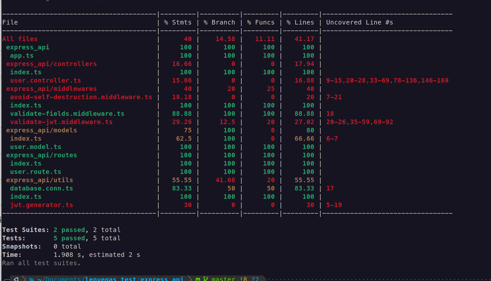

# Express API with Docker and MySQL

This project is an Express.js API that uses MySQL as the database. Both the API and the database run in separate Docker containers.

---

## Prerequisites

1. **Docker**: Ensure Docker is installed on your machine.
   - [Install Docker](https://docs.docker.com/get-docker/)
2. **Node.js and npm** (for local development, optional)
   - [Install Node.js](https://nodejs.org/)

---

## Getting Started

### 1. **Clone the Repository**

```bash
git clone https://github.com/crokenx/leovegas_test.git
cd leovegas_test
```

### 2. **Environment variables**

```bash
# cd the recently created repo
cd express_api/
```

### 2.1 **Now create a .env file like the following**

```bash
# App variables
PORT=3000

# Database variables
DB_HOST='leovegas-db'
DB_USER='root'
DB_PASSWORD='db_leovegas'
DB_NAME='db_leovegas'
DB_PORT=3306

# JWT Secret
JWT_SECRET='kJ8!xV@43m#Ql2$y7Z&9DpW#tP*r6N%o' 
# or some value that you consider would work as a good salt for encrypting passwords
```

I know is not secure to let credentials in such a way.

### 2.2 **Edit docker file of the database (optional)**

Another requirement if you like is to change the data base name and the password with which we create the database in further steps

```bash
cd ../db
```

Here you will find a Dockerfile, please edit the Dockerfile if you want to change de default values I left and update the previously created **.env** file with the credentials you puut in here, you should only edit the variables **MYSQL_DATABASE** or **MYSQL_ROOT_PASSWORD** (yes I know, I didn't create a admin user for the test), I know is not secure to let keys in such a way but this test is mean to show practice with Nodejs.

### 3. **Build and Run the Docker Containers**

Now we will have to set up the containers.

### 3.1 **Create docker custom network**

We should create a custom network to ensure that the containers can reach each other

```bash
sudo docker network create leovegas-net
```

If you change the name of the network "leovegas-net" to something else **you must update the .env file**

### 3.1 **Database container**

If you did the step **2.2** you already should be in the dir to run the docker container for the database. If not please go to the **db** folder of the project.

Now run the following command on the terminal:

```bash
sudo docker build -t leovegasdb:v1 . 
```

This will create the custom image of mysql that I did for this test, this image will create the scheme on the database required by this test.

Now run the following command to bring up the container with the database:

```bash
sudo docker run --name leovegas-db -d -p 3306:3306 --network leovegas-net leovegasdb:v1
```

If you change the name of container "leovegas-db" to something else **you must update the .env file**

port argument is only necesary when we are in development environment.

### 3.2 **Application container**

Please move to the **express_api** folder, we will have to create the docker image from there.

Now run the following command on the terminal:

```bash
sudo docker build -t express_api:v1 . 
```

This will create a docker image of the application.

Now run the following command to bring up the container with the application running:

```bash
sudo docker run -p 8080:3000 --network leovegas-net express_api:v1
```

### 4 **You can now test the application with the following routes**

### 4.1 **Create admin user | Post request**

http://localhost:8080/api/v1/users

### 4.2 **Create normal user | Post request**

http://localhost:8080/api/v1/users

### 4.3 **Get list of users | Get request | must be admin user**

http://localhost:8080/api/v1/users

### 4.4 **Get own info normal user | Get request | must have and own valid access_token**

http://localhost:8080/api/v1/users/10

### 4.5 **Get anyone info | Get request | must be admin user | must have and own valid access_token**

http://localhost:8080/api/v1/users/10

### 4.6 **Update own info normal user | Put request | must have and own valid access_token**

http://localhost:8080/api/v1/users/10

### 4.7 **Update someone info admin user | Put request | must be admin user | must have and own valid access_token**

http://localhost:8080/api/v1/users/10

### 4.8 **Delete someone admin user | Delete request | must be admin user | must have and own valid access_token**

http://localhost:8080/api/v1/users/10

### **I will share through email a postman collection as well**

### 5 **Test coverage**

I didn't have more time for test so I tried to test the user routes only.

To run the test, please go to the **express_api** folder and run the following command:

```bash
npm run test
```

It should prompt you with something like:

